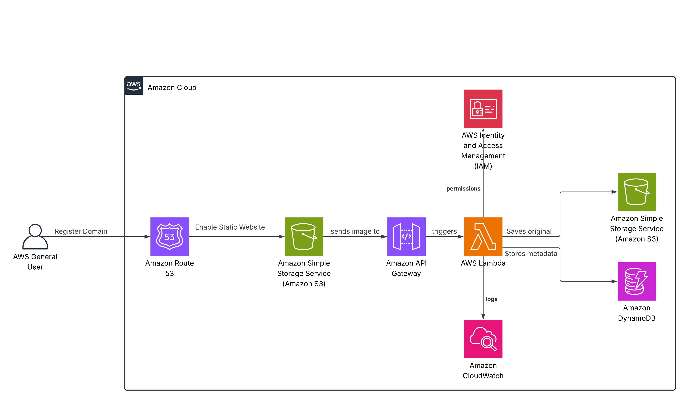

# Manara_Project
# Serverless Image Processing with S3 and Lambda

## Project Description

This project implements a fully serverless image upload and metadata management application using AWS. Users can upload images via an HTTP API, which triggers a Lambda function that stores the image in an S3 bucket and records metadata (like file name, type, and upload time) in DynamoDB. This showcases a real-world event-driven architecture using AWS services.

---

##  AWS Services Used
| Service               | Purpose                                                              |
|------------------------|----------------------------------------------------------------------|
| **Amazon Route 53**     | Manages the custom domain for the API                               |
| **Amazon API Gateway**  | Provides the public REST API endpoint to trigger the workflow       |
| **AWS Lambda**          | Executes logic for validation, processing, uploading, and saving data|
| **Amazon S3**           | Stores original and processed image files                           |
| **Amazon DynamoDB**     | Stores image metadata (filename, size, upload date)                 |
| **Amazon CloudWatch**   | Logs function execution and monitors performance                    |
| **IAM Roles**           | Manages secure access between AWS services                          |

---

##  Architecture Overview
1. The user accesses the service via `https://upload.mennaimages.com`.
2. API Gateway receives the image upload request and triggers a Lambda Function.
3. Lambda:
   - Stores the image in an S3 bucket.
   - Saves metadata in DynamoDB.
   - Logs execution via CloudWatch.
4. CloudWatch monitors and logs all Lambda executions.

---
## Deployment Steps
1. Create S3 Bucket
   - Name: image-upload-bucket
   - Enable public read or presigned URL access (optional)
   - Enable permissions for Lambda

2. Create DynamoDB Table
   - Name: ImageMetadata
   - Primary key: id (string)

3. Create IAM Role for Lambda
   - Permissions: s3:PutObject - dynamodb:PutItem
   - logs:*

4. Create Lambda Function
   - Name: upload_image
   - Runtime: Python 3.12
   - Handler: lambda_function.lambda_handler
   - Environment variables: BUCKET_NAME - TABLE_NAME

5. Create API Gateway
   - Method: POST /upload
   - Integration type: Lambda proxy
   - Enable CORS for browser access

6. Route 53 Setup
   - Create or configure a domain (e.g., mennaimages.com)
   - Add a hosted zone
   - Map upload.mennaimages.com to the API Gateway custom domain name

7. Enable CloudWatch Logging
   - View logs for Lambda function execution and errors

--- 
## Learning Outcomes
1. Build a serverless image uploader using core AWS services

2. Use API Gateway + Lambda to process secure HTTP requests

3. Store image files in S3 and metadata in DynamoDB

4. Monitor and debug using CloudWatch

5. Configure a custom domain using Route 53
